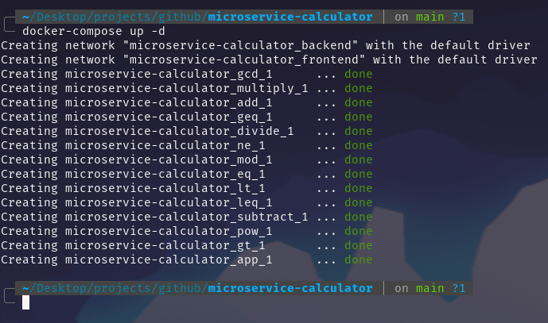
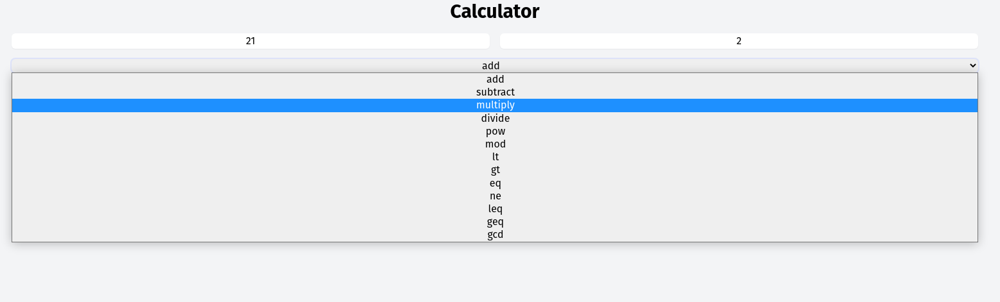
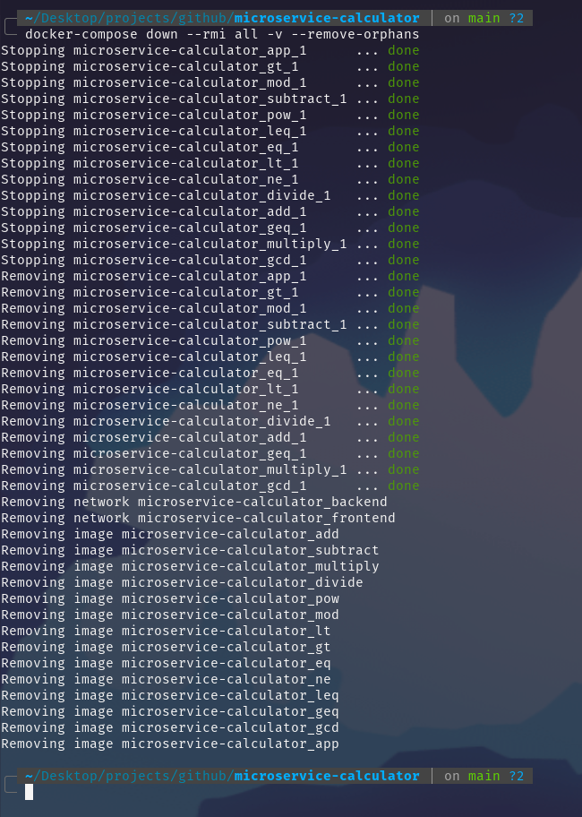

# microservice-calculator

Simple calculator application that uses microservices to perform mathematical operations. It is the project coursework for UE20CS351 - Cloud Computing. The problem statement can be found [here](https://github.com/ta-cc-2023/UE20CS351-Cloud-Computing-Problem-Statements/tree/main/Project-4).

### Team

| **Name**          | **SRN**       |
|-------------------|---------------|
| Aryan Rawther     | PES1UG20CS082 |
| Aryan V S         | PES1UG20CS083 |
| Aryansh Bhargavan | PES1UG20CS084 |
| Ashish Kulkarni   | PES1UG20CS085 |

### Installing

```
git clone https://github.com/a-r-r-o-w/microservice-calculator
cd microservice-calculator
```

### Screenshots

**Starting Application**

```
docker-compose up -d
# Note that first run may take some time as docker will install
# required images and set up microservices one by one
```



<br />

**Using Application**



<br />


<br />

**Stopping Application**

```
docker-compose down --rmi all -v --remove-orphans
```


